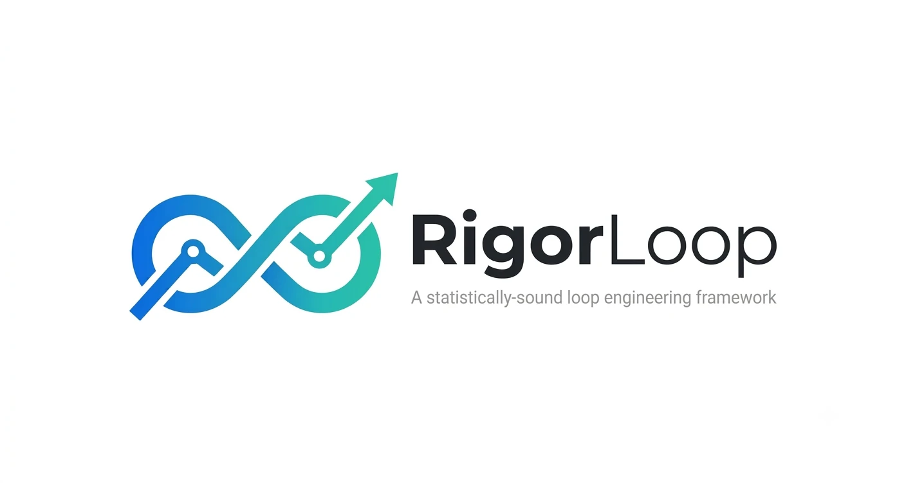

<p align="center">
  
</p>

# RigorLoop

A statistically-sound agentic loop-engineering framework. You give it a task description,
a pile of gold-standard input/output examples, and a set of checks; it runs
agentic loops (a strategy agent directing concurrent executor agents) that
iteratively build and refine a solution — and it evaluates that solution the
way a careful data scientist would: on a strict **dev / validation / test**
split, so the score you see at the end is one you can actually trust.

The solution it produces is a portable artifact you can take away and use
without RigorLoop:

- an **executable Python script** (reads your input on stdin, writes the output),
- an **agent skill** (a `SKILL.md`-style document, e.g. for Claude Skills), or
- a **guidance file** (an `AGENTS.md`/`CLAUDE.md`-style document for coding agents).

## When to use it (and when not to)

Use RigorLoop for **data-science-like transformation tasks**: you have many
representative examples of messy inputs (structured or unstructured text) and
the structured outputs you want, and you need a solution that generalizes to
*new* inputs — extraction, normalization, classification-with-output-format,
reformatting, tagging.

Do **not** use it to generate a simple deterministic script that just needs to
pass a handful of fixed unit tests — a single coding-agent session does that
job better. RigorLoop's machinery (splits, confidence intervals, budgeted
validation peeks) only pays off when overfitting is a real risk.

## Requirements

- **Python ≥ 3.12** on Linux or macOS (Windows is not supported in v1)
- The **[claude CLI](https://claude.com/claude-code)** installed and
  authenticated (`claude --version` should work) — agents are invoked
  headless and tool-less via `claude -p`
- **Examples: the more, the better.** RigorLoop will run with a couple dozen,
  but it will warn you plainly about what small sets can and cannot prove
  (with ~30 examples, a validation set of 6 can only distinguish pass-rate
  differences of roughly ±40 points). Aim for 100+ if you can.
- A budget: every loop spends real model calls. `rigorloop check` estimates
  the call count before you commit (skill/guidance artifacts cost far more to
  evaluate than scripts, because *evaluating* each example is itself a model
  call).

## Install

```bash
pip install rigorloop
```

## Quickstart

```bash
mkdir my-task && cd my-task
rigorloop init      # scaffolds rigorloop.toml, task.md, examples.jsonl (a toy dataset)
# 1. Describe your task in task.md
# 2. Replace examples.jsonl with your real examples
# 3. Adjust rigorloop.toml (solution kind, checks, budgets)
rigorloop check     # validates everything, prints split sizes, warnings, and
                    # the agent-call budget estimate — spends no tokens
rigorloop run       # runs the loops; artifacts land in runs/<run_id>/
```

When the run finishes you get, under `runs/<run_id>/final/`:

- **the solution** (`solution.py`, `SKILL.md`, or `GUIDANCE.md`) — copy it out
  and use it anywhere;
- **`report.md`** — pass rates with 95% confidence intervals on all three
  splits, per-check breakdowns, the loop history, and honest caveats about
  what the numbers mean;
- `test_results.json` — the same, machine-readable.

A run that stops midway (crash, Ctrl-C) can be continued with
`rigorloop run --resume <run_id>`, and `rigorloop report <run_id>` re-renders
the report of a finished run.

## What you provide

**`task.md`** — a plain-language description of the transformation, written
for the agent that will build the solution. Say what the inputs look like,
what the outputs must look like, and any rules that matter.

**`examples.jsonl`** — one JSON object per line:

```jsonl
{"input": "Name: Ada Lovelace\nEmail: ada@calc.org\nCity: London", "expected_output": "{\"city\": \"London\", \"email\": \"ada@calc.org\", \"name\": \"Ada Lovelace\"}"}
```

Both fields may be strings or JSON structures (structures are canonicalized to
JSON text). These examples should be *highly representative* of the inputs
you'll see in production — the final score is only as honest as the examples
are representative.

**Checks** — one or more `[[checks]]` blocks in `rigorloop.toml`. An example
passes only if **every** check passes:

| `type` | What it verifies | Options (defaults) |
|---|---|---|
| `exact_match` | output equals the expected output | — |
| `normalized_match` | equal after normalization | `lowercase`, `strip`, `collapse_whitespace` (all `true`) |
| `json_equality` | output parses to the same JSON value | — |
| `regex_match` | output contains a match | `pattern` (required) |
| `numeric_tolerance` | output is a number within tolerance | `atol`, `rtol` (`1e-6`) |
| `custom_python` | your own checker script passes | `script_path` (required); gets JSON on stdin, exit 0 = pass, 1 = fail |
| `llm_judge` | a model judges the output against a rubric | `rubric` (required), `n_samples` (3), `pass_threshold` (0.5) |

## The knobs (`rigorloop.toml`)

Everything has a sensible default; a minimal config is just the `[task]`
section and one check.

```toml
[task]
description_file = "task.md"
solution_kind    = "script"        # script | skill | guidance
examples_file    = "examples.jsonl"

[split]
ratios = [0.6, 0.2, 0.2]           # dev / validation / test
seed   = 17                        # same seed => same split, always

[loop]
max_loops              = 12        # hard cap on strategy loops
executors_per_loop     = 4         # concurrent solution builders per loop
dev_examples_in_prompt = 30        # examples each builder sees (resampled per loop)

[validation]
val_every        = 3               # scheduled validation checkpoint cadence
max_peeks        = 10              # total candidate validation evaluations per run
cohort_size      = 2               # candidates validated per checkpoint: top dev
                                   # scorers + one diverse (non-champion-based) slot
patience         = 2               # checkpoint loops without real improvement => stop
target_pass_rate = 0.95            # optional: stop early once the validation score's
                                   # lower confidence bound clears this

[agents]
model     = "claude-sonnet-5"      # model for all agent roles
timeout_s = 300

[[checks]]
type = "json_equality"
```

The knobs that matter most in practice:

- **`solution_kind`** — also sets the evaluation cost model: scripts are
  executed locally (cheap); skills/guidance are evaluated by running a model
  per example (expensive — check the budget estimate).
- **`max_loops` × `executors_per_loop`** — your primary cost lever.
- **`max_peeks` / `cohort_size` / `patience`** — how many candidate evaluations
  the loop may spend on the validation set, how many candidates each checkpoint
  compares, and how long the loop tolerates no genuine (beyond-noise)
  improvement before stopping. For expensive artifact kinds (skill/guidance),
  every validation evaluation is a model call per example — keep `cohort_size`
  small and watch the budget estimate.
- **`seed`** — makes the split reproducible; changing it reshuffles which
  examples land in the holdout.

## How it stays honest

- Your examples are split once, up front; the split is fingerprinted so a
  resumed run can never quietly reshuffle it.
- The building agents only ever see **dev** examples. Validation scores reach
  the strategy agent only as aggregates; test examples reach no agent, ever.
- The artifact each loop refines is the **validation champion** — the
  candidate with the best evidence of generalizing — not the raw dev leader.
  Each checkpoint validates a precommitted cohort (the top unvalidated dev
  candidates plus one diverse alternative not built on the champion), so a
  candidate that is slightly worse on dev but generalizes better still gets
  discovered. The dev leaderboard is a diagnostic, not a selection rule.
- "Improved" always means *beyond the statistical noise band* (paired tests),
  not just a higher number — so the loop doesn't chase luck. Early stopping on
  `target_pass_rate` likewise requires the validation score's *lower
  confidence bound* to clear the target, not a lucky point estimate.
- The validation set (capped, counted peeks) steers the search and picks the
  winner — which is ordinary model selection, but it means the winner's
  validation score is optimistically biased. That is exactly what the **test
  set** is for: it is evaluated **exactly once**, at the very end, and that is
  the number to report.

## ⚠️ The final test set is only honest once

RigorLoop holds out a final test set and evaluates the winning solution on it **exactly once per run**. That guarantee cannot protect you from yourself *across* runs: if you look at the test score, tweak your task description or checks, and re-run on the same examples file, the "held-out" test set is no longer unseen. After a few such iterations it has effectively become a second validation set, and its scores will be optimistically biased.

If you iterate after seeing a test result, treat that test set as spent — supply fresh, never-before-used examples for the next run's holdout.

Related caveat: RigorLoop deduplicates *exact* duplicate inputs before splitting, but near-duplicates (the same example lightly reworded) can still straddle the dev/test boundary and quietly inflate test scores. If your dataset may contain near-duplicates, deduplicate it yourself before handing it to RigorLoop.

## Other things worth knowing

- **RigorLoop runs generated code on your machine.** Candidate scripts and
  `custom_python` checks execute as subprocesses with timeouts and output
  caps — guardrails, not a security boundary. Run inside a container/VM if
  that worries you. See `SECURITY.md`.
- Your task description and dev examples are sent to the model; validation
  and test examples are embedded one at a time in evaluation calls. Don't
  include data that must not leave your machine.
- Skill/guidance scores are conditional on the evaluating model (pinned in
  the run manifest) and are measured tool-less; transfer to tool-using agents
  in the wild is weaker, and the report says so.

## Example

A complete toy project (contact-card text → JSON) lives in
[`examples/contact-cards/`](examples/contact-cards/) — it is exactly what
`rigorloop init` scaffolds.


## FAQ

### When should I use this?

When all three of these are true:

1. **The task is a transformation with a checkable right answer** — messy
   text in, structured output out (extraction, normalization, tagging,
   classification-with-a-format) — and "correct" can be expressed as checks.
2. **You have, or can collect, a real pile of gold examples** — dozens at
   minimum, ideally 100+ — that are representative of the inputs you'll see
   in production.
3. **What you care about is performance on *new* inputs**, and you need a
   score you can quote without an asterisk.

If any of these is false, don't reach for RigorLoop. No examples means there
is nothing to split and nothing to measure honestly. And if the goal is a
deterministic script that passes a fixed handful of unit tests, a single
coding-agent session is cheaper and better — see
[When to use it (and when not to)](#when-to-use-it-and-when-not-to).

### Can't standalone frontier agents do this? Why should I use this?

A frontier agent can absolutely write the solution — RigorLoop's executors
*are* frontier agents doing exactly that. What a standalone session can't
give you is a score you can trust. Hand an agent your examples and ask it to
iterate until things pass, and it grades its own homework: "98% accurate"
means 98% on the very examples it tuned against, which says little about the
next thousand inputs. There is no held-out data, no accounting of how many
times it peeked, and no way to tell a real improvement from a lucky one.

RigorLoop is the harness around those agents that supplies the missing
discipline:

- **a dev / validation / test split**, enforced up front — building agents
  only ever see dev examples, and the test set is scored exactly once, at
  the end;
- **statistics instead of vibes** — confidence intervals on every score,
  paired tests so "improved" means beyond the noise band, and a counted,
  capped budget of validation peeks;
- **search instead of one shot** — a strategy agent directing concurrent
  executors across many loops, keeping the candidate with the best evidence
  of *generalizing* rather than the one that got luckiest on dev.

You could rebuild all of that by hand around a chat session. RigorLoop is
that machinery, prebuilt and honest by construction.

### What do I do if the solution the loop converges to still isn't accurate enough?

First, believe the number — that's the point of the tool. An honest 74% is
worth more than the inflated score a self-graded loop would have reported,
because it tells you the problem isn't solved yet. Then work through this
list, roughly cheapest first:

1. **Read `report.md`.** The per-check breakdown and loop history usually
   show *how* it fails: one check dominating the failures, scores plateauing
   after a couple of loops, or confidence intervals so wide the run couldn't
   tell candidates apart.
2. **Check your checks.** An `exact_match` where you meant
   `normalized_match` or `json_equality`, or a vague `llm_judge` rubric, can
   make a good solution look bad.
3. **Sharpen `task.md`.** Failing examples often reveal rules and edge cases
   the description never stated. Spell them out.
4. **Add more — and more representative — examples.** Small sets cap what
   the loop can even detect (heed the power warnings from
   `rigorloop check`), and noisy labels cap the ceiling no solution can
   exceed.
5. **Raise the budget.** More `max_loops`, `executors_per_loop`, and
   `max_peeks` buy a wider search; a stronger model in `[agents]` buys
   better builders.
6. **Reconsider `solution_kind`.** A deterministic script may be too rigid
   for a fuzzy task; a `skill` or `guidance` artifact puts a model in the
   loop at inference time (at a much higher evaluation cost).
7. **Decompose the task.** Two simple transformations chained often beat one
   complicated one.

One caution: the moment you iterate *after* seeing a test score, that test
set is spent — bring fresh, never-before-used examples for the next run's
holdout (see "The final test set is only honest once" above).

## Contributing & development

See [`CONTRIBUTING.md`](CONTRIBUTING.md). The design plan is in `PLAN.md`, the
packaging/release plan in `PACKAGING_PLAN.md`, and the (strict) coding rules
in `CODING_STYLE.md`.

## License

MIT — see [`LICENSE`](LICENSE).
